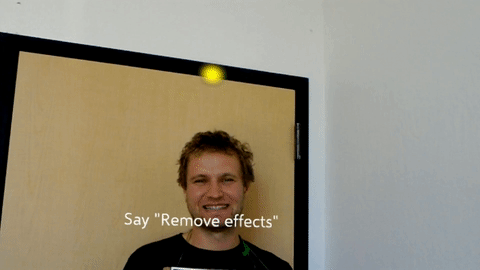
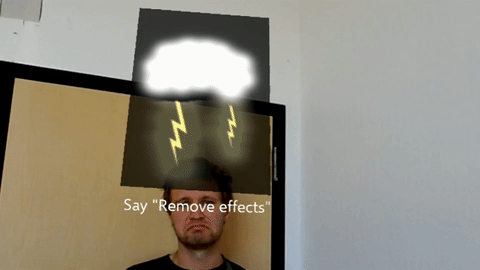
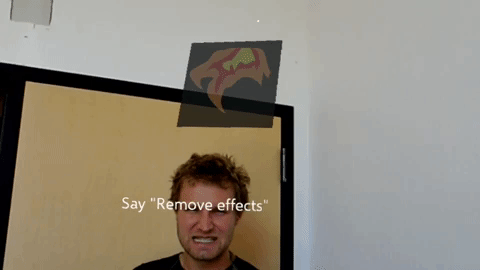
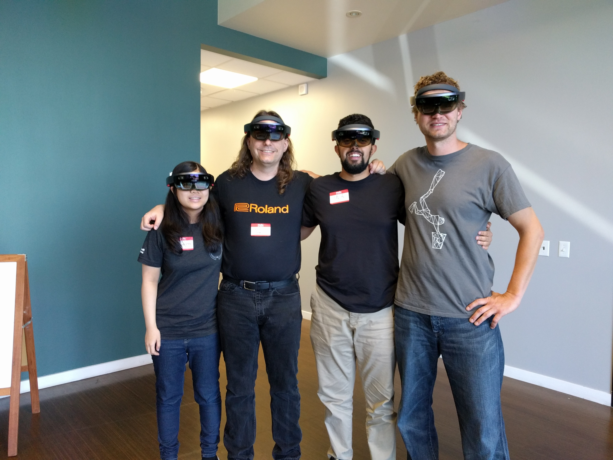

# GlitchView

**GlitchView** is Diminished Reality (DR)/Mixed Reality(MR) HoloLens application that changes how we socially interact. Inspired by a dystopic application of future Extended Reality(xR) tools found in Black Mirror's White Christmas episode, we built a tool that allows you to block those you no longer want to see or listen to. Considering how well people take to dystopian futures, we also implemented an interface that augments user interaction with emotion expressing emojis.

## Features
We use audio commands as our main mode of interface. Bellow are the three voice commands. We also utilize a gaze cursor to visualize the user's center of gaze.
### "Block Person"
This command causes other persons in the vicinity of the user to be blocked out from head to toe. We use a camouflage/static like texture to remove the user. We also distort the audio coming from the blocked user's direction with disruptive white noise.

 
*Krzy keeps distrupting our conversation by talking on the phone. He deserves to be blocked.*

### "How's It Going?"
This command augments user's view of other persons by detecting a person's emotion and attaching an animated emoji that describes that emotion above their head. We currently support three main emotions. Happiness, Sadness, and Anger. There is an artifact of a dark background that appears only in the video capture. It does not appear when using the application.

*Happy Krzy is radient.*
 
 

*Sad Krzy is blue...*
 
 

*Angry Krzy goes wroar!*

### "Remove Effects"
This commands is used to remove any xR effects that were already applied. It returns you to the normal state.

## Team

 
*Lauren Chun (Art), Chris Oats (Shaders), Talal Alothman (Programming), Krzysztof Barczynski (Programing)*

